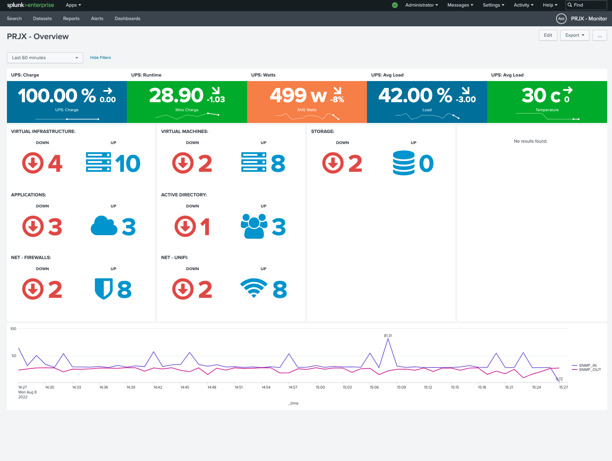
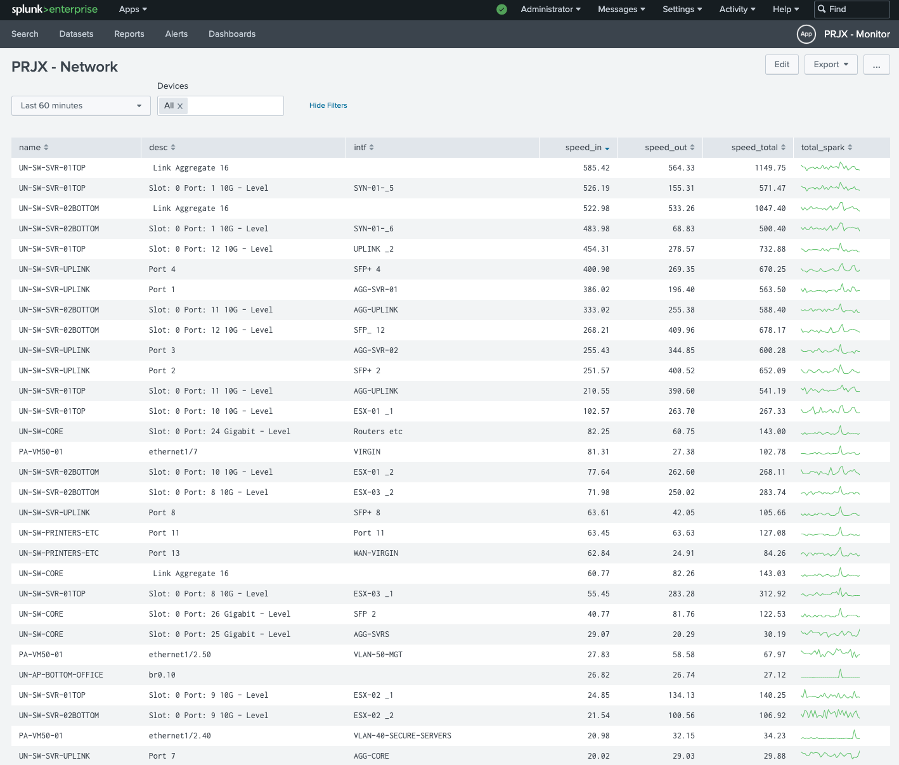

# QASA (Query Anything, Send Anywhere)

Query your devices and systems for useful data (SNMP, HTTP etc), and send the results onwards... perhaps to a Log analytics system or syslog server... It really doesn't care!

I highly recommend reading this whole page before attempting to deploy QASA, especially understand the concepts of the Pollers, Formatters and Senders - it will make your life easier when trying to configure it.

## Why use is it?

Software such as Grafana and Prometheus, can already do the querying, and give pretty analytics dashboards - So why this? Well thats upto you, but for me:

- first, I don't want to run a dozen different monitoring apps, I want everything (Logs, Polls, Status etc) under 1 monitoring app.
- second, I wanted the the ability to be able to move where the data was sent, i.e. Splunk, ELK, Loki or even a cloud service.
- third, I used this alongside other agents, including MetricsBeat, and they compliment each other.

I'm releasing it now, as whilst I can spend weeks or months adding other features, but actually,  I've used it for over a year now, and its been pretty solid for monitoring:

- Network throughput on my Firewall and Switches
- UPS performance (Load, remaining time etc)
- NAS storage utilisation
- Check websites are available and latency load times
- Query certain Web APIs

Uptime Kuma has inspired me to add  Web UI to it

## A quick demo of getting it working:

The data gets pushed into `your-choice-solution,` in my case its **Splunk**, and I generate dashboards like this with metrics taken from QASA and also syslog from the devices:

| Screenshot #1                                                              | Screenshot #2                                                             |
| ---------------------------------------------------------------------------- | --------------------------------------------------------------------------- |
|  |  |

## What is it?

QASA is basically a scheduler, which

1. Polls ad-hoc systems every X seconds, using SNMP and HTTP etc
2. Formats the returned data, into a consumable format such as JSON or CSV etc
3. Sends the formatted data onto a remote system, such as Logstash, Splunk HEC, Syslog Server, OpenSearch (via HTTP) etc

Some key benefits are

- Multi-threaded - Being able to poll a large number of devices simultaneously.
- Small footprint - Using less that 60MB for polling my whole homelab every 15 seconds (which includes 6 switches, 5 APs, 4 Firewalls and dozens of HTTP endpoints)
- Flexible - allowing the results from each to be formatted different and sent different destinations (if desired).

# Installation

I recommending reading this whole page before starting, but for a quick-start guide, plus manual install instructions, see the [install guide](docs/index.md)

# Configuration

Ensure to read the installation instructions first, for specific instructions on each Poller, Formatter and Sender, please use the following links:

| **File**                               | **Purpose**                                                                               |
| ---------------------------------------- | ------------------------------------------------------------------------------------------- |
| [ settings.yml ](docs/settings.md)     | General settings                                                                          |
| [ pollers.yml ](docs/pollers.md)       | Devices to poll, including connection details, formatter and sender to use for the poller |
| [ formatters.yml ](docs/formatters.md) | Response output formatters, including their settings such as time formats etc             |
| [ senders.yml ](docs/senders.md)       | Send output to these destination, including connection details                            |

## Whats under the hood?

QASA is completely written in Python, and its intended to be run as a single Container, but this can be scaled up. There are 3 main parts to QASA:

## 

The Scheduler creates a thread for each Poller, which runs as: Poll for Data > (re)Format Data > Send Data on, then sleeps for a defined interval. The main benefits are:

- You can use any combination of Poller, Formatter and Sender
- You can easily change format and destinations - i.e. Want to move your data from Splunk to GrayLog? Easy, just switch the Sender from SplunkHEC to Logstash
- You want to format the data in a new way? Easy, you can create a new Formatter with a few lines of Python, drop in the Formatters directory and use it in your config (same for Pollers and Senders)

### What exists

As mentioned, the main purpose of developing this was for use in a homelab, so I've only implemented my requirements so far, these include:

|                           |                |                                             |
| --------------------------- | ---------------- | --------------------------------------------- |
| **Pollers**               | **Formatters** | **Senders**                                 |
| SNMP Network Device *     | JSON           | Splunk HEC                                  |
| SNMP APC UPS              | CSV            | Logstash (TCP/UDP)                          |
| SpeedTest (WIP)           | Dict *         | Syslog (TCP and UDP)                        |
| HTTP Check (inc. Content) |                | Local File                                  |
|                           |                | OpenSearch ElasticSearch ZincSearch |
|                           |                |                                             |

(* Please be aware, only SNMP 2c supported at present. This formatter returns a Python Dict object, its intended for use with OpenSearch, ElasticSearch and ZincSearch)

# Immediate Roadmap

1. Remove the seperate "alias" field, this should be taken from the yaml section name
2. Properly document debug logging to file
3. Add Ping and traceroute pollers
4.

# ** Possible future enhancements **

Note, this is just my ideas wishlist... don't expect anything to happen:

1. Refactor Pollers, to make them easier for others to create new pollers or extend existing ones.
   2Add "Content-Type" return to each Formatter class, i.e. json or text, for use in the senders
   3Update FileSender to do file rotation
   4Consider changing "time" field to "@timestamp"
   5Pollers
   1. Add SNMP 3 support.
   2. Change from using PySNMP (Developer is no longer maintaining)
   3. Speedtest.net
   4. ~~Ping~~
   5. HTTP API call
   6. Trace Route
   7. Get IP Address
   8. Add SSL Expiry checks
2. Additional Settings:
   - Add on/off switches for additional useful fields in formatter (host, IP, ALIAS, SNMP type)
   - Add config setting for applog level (Info or Debug)
3. Add Command-Line
   - Save/Serialise Output (for future test runs)
   - Use saved content for test run
4. Implement usage of settings.yml (Currently these are ignored)
5. Add "Processors", that get executed between Poll > Format > Send, uses cases
   - Remove entries is certain value found (for example, bandwidth = 0.. no point recording it)
   - Reformat certain values
6. Add OpenSearch and ZincSearch Senders
7. Add Tags arg to SNMP Pollers and ensure they are pass through Senders

# Background

---

I started writing this in summer of 2020, I've personally been using it since then and making incremental changes. I never intended to open source it, but some users in r/homelab showed an interest, so I thought why not. You many find references to "QTool" in the code, this was its original name, but I was preparing for a trip to our home in Spain at the time, and QASA seemed to have a better ring to it.
